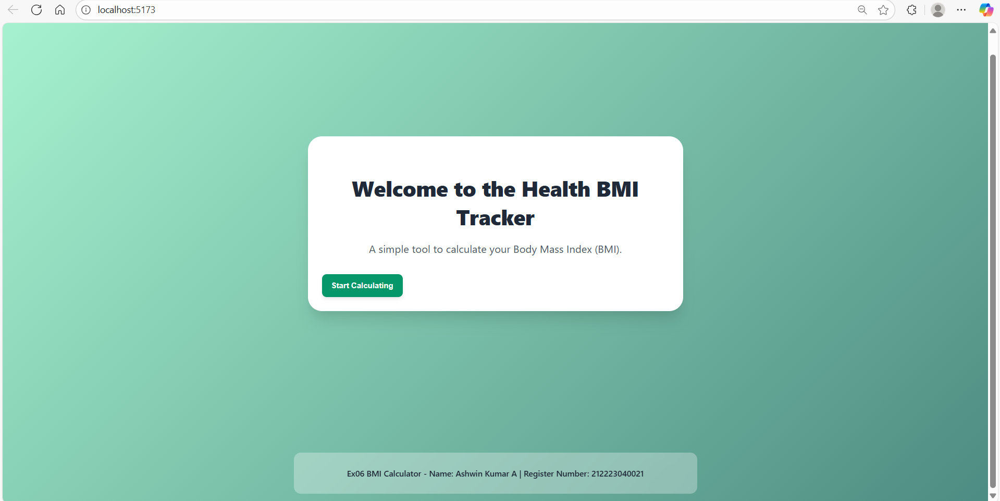
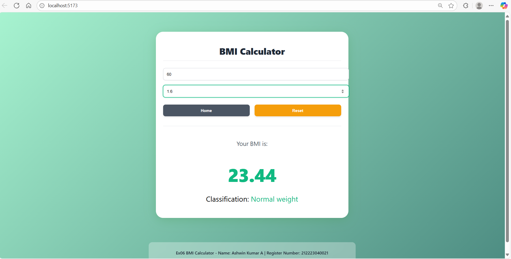

# Ex06 BMI Calculator
## Date:12.11.2025

## AIM
To create a BMI calculator using React Router 

## ALGORITHM
### STEP 1 State Initialization
Manage the current page (Home or Calculator) using React Router.

### STEP 2 User Input
Accept weight and height inputs from the user.

### STEP 3 BMI Calculation
Calculate the BMI based on user input.

### STEP 4 Categorization
Classify the BMI result into categories (Underweight, Normal weight, Overweight, Obesity).

### STEP 5 Navigation
Navigate between pages using React Router.

## PROGRAM
### Main.jsx:

``` 
import React from 'react';
import ReactDOM from 'react-dom/client';
import App from './App.jsx';
import './App.css';

ReactDOM.createRoot(document.getElementById('root')).render(
  <React.StrictMode>
    <App />
  </React.StrictMode>,
);
```

### App.jsx:
```
import React, { useState, useMemo } from 'react';

const calculateBMI = (weight, height) => {
  if (!weight || !height || height <= 0 || weight <= 0) return null;
  
  const bmiValue = weight / (height * height);
  const roundedBmi = parseFloat(bmiValue.toFixed(2));

  let category = '';
  let colorClass = 'text-gray-700';

  if (roundedBmi < 18.5) {
    category = 'Underweight';
    colorClass = 'text-blue-500 font-bold';
  } else if (roundedBmi >= 18.5 && roundedBmi < 24.9) {
    category = 'Normal weight';
    colorClass = 'text-green-500 font-bold';
  } else if (roundedBmi >= 25 && roundedBmi < 29.9) {
    category = 'Overweight';
    colorClass = 'text-yellow-500 font-bold';
  } else {
    category = 'Obesity';
    colorClass = 'text-red-500 font-bold';
  }

  return { value: roundedBmi, category, colorClass };
};

// 2. Calculator Component
const Calculator = ({ navigateTo }) => {
  const [weight, setWeight] = useState('');
  const [height, setHeight] = useState('');

  const handleWeightChange = (e) => {
    const val = e.target.value;
    if (val === '' || (parseFloat(val) >= 0 && !isNaN(parseFloat(val)))) {
      setWeight(val);
    }
  };

  const handleHeightChange = (e) => {
    const val = e.target.value;
    if (val === '' || (parseFloat(val) >= 0 && !isNaN(parseFloat(val)))) {
      setHeight(val);
    }
  };

  const bmiResult = useMemo(() => calculateBMI(parseFloat(weight), parseFloat(height)), [weight, height]);

  const resetFields = () => {
    setWeight('');
    setHeight('');
  };

  return (
    <div className="calculator-content">
      <h1>BMI Calculator</h1>

      <div className="space-y-4">
        <div className="input-group">
          <input
            type="number"
            value={weight}
            onChange={handleWeightChange}
            placeholder="Weight (in kg)"
            className="input-field"
            aria-label="Weight in kilograms"
            min="0"
          />
        </div>

        <div className="input-group">
          <input
            type="number"
            step="0.01"
            value={height}
            onChange={handleHeightChange}
            placeholder="Height (in meters)"
            className="input-field"
            aria-label="Height in meters"
            min="0"
          />
        </div>
      </div>

      <div className="button-group">
        <button 
          onClick={() => navigateTo('home')}
          className="btn btn-secondary"
        >
          Home
        </button>
        <button
          onClick={resetFields}
          className="btn btn-warning"
        >
          Reset
        </button>
      </div>

      {/* BMI Result Display */}
      {bmiResult && (
        <div className="result-display">
          <p className="label">Your BMI is:</p>
          <h2 className="bmi-value">
            <span className={bmiResult.colorClass}>
                {bmiResult.value}
            </span>
          </h2>
          <p className="classification">
            Classification: <span className={bmiResult.colorClass}>{bmiResult.category}</span>
          </p>
        </div>
      )}

      {bmiResult === null && (weight !== '' || height !== '') && (
          <p className="mt-6 text-center text-sm text-red-500 italic">
              Please enter valid positive values for both weight and height to calculate BMI.
          </p>
      )}

    </div>
  );
};

// 3. Home Component
const Home = ({ navigateTo }) => (
  <div className="home-content">
    <h1>
      Welcome to the Health BMI Tracker
    </h1>
    <p>
      A simple tool to calculate your Body Mass Index (BMI).
    </p>
    <button
      onClick={() => navigateTo('calculator')}
      className="btn btn-primary"
    >
      Start Calculating
    </button>
  </div>
);

// 4. Main App Component (Handles Routing)
const App = () => {
  const [currentPage, setCurrentPage] = useState('home');

  const navigateTo = (page) => {
    setCurrentPage(page);
  };

  let content;
  switch (currentPage) {
    case 'calculator':
      content = <Calculator navigateTo={navigateTo} />;
      break;
    case 'home':
    default:
      content = <Home navigateTo={navigateTo} />;
      break;
  }

  return (
    <div className="app-container">
      
      <div className="card">
        {content}
      </div>

      {/* Footer (Requested by User) */}
      <footer className="footer">
        <p>
          Ex06 BMI Calculator - Name: Ashwin Kumar A | Register Number: 212223040021
        </p>
      </footer>
    </div>
  );
};

export default App;
```

### App.css:
```

body {
  margin: 0;
  padding: 0;
  font-family: ui-sans-serif, system-ui, sans-serif;
  height: 100vh;
}

.app-container {
  min-height: 100vh;
  display: flex;
  flex-direction: column;
  align-items: center;
  justify-content: center;
  padding: 1rem;
  /* Green Gradient Background */
  background: linear-gradient(135deg, #a7f3d0, #4d8c82); 
}

/* Card Styling */
.card {
  background-color: white;
  border-radius: 1.5rem; /* rounded-2xl */
  box-shadow: 0 20px 25px -5px rgba(0, 0, 0, 0.1), 0 10px 10px -5px rgba(0, 0, 0, 0.04); /* shadow-2xl */
  max-width: 40rem; /* max-w-xl */
  width: 100%;
  margin: auto;
  transition: transform 0.5s, box-shadow 0.5s;
}

.card:hover {
  box-shadow: 0 0 40px rgba(76, 175, 80, 0.4); /* Custom hover shadow */
}

/* Home Component Styling */
.home-content {
  padding: 1.5rem;
  text-align: center;
}

.home-content h1 {
  font-size: 2.25rem; /* text-4xl */
  font-weight: 800; /* font-extrabold */
  color: #1f2937; /* text-gray-800 */
  margin-bottom: 1rem;
  padding-top: 1rem;
}

.home-content p {
  font-size: 1.125rem; /* text-lg */
  color: #4b5563; /* text-gray-600 */
  margin-bottom: 2rem;
}

/* Calculator Component Styling */
.calculator-content {
  padding: 1.5rem;
}

.calculator-content h1 {
  font-size: 1.875rem; /* text-3xl */
  font-weight: 800; /* font-extrabold */
  color: #1f2937;
  margin-bottom: 1.5rem;
  padding-bottom: 0.75rem;
  border-bottom: 1px solid #e5e7eb; /* border-b pb-3 */
  text-align: center;
}

/* Input Styling */
.input-group {
  margin-bottom: 1rem;
}

.input-field {
  width: 100%;
  padding: 0.75rem;
  border: 1px solid #d1d5db; /* border border-gray-300 */
  border-radius: 0.5rem; /* rounded-lg */
  transition: border-color 0.3s, box-shadow 0.3s;
  box-shadow: 0 1px 2px 0 rgba(0, 0, 0, 0.05); /* shadow-sm */
}

.input-field:focus {
  outline: none;
  border-color: #10b981; /* focus:border-green-500 */
  box-shadow: 0 0 0 2px rgba(16, 185, 129, 0.5); /* focus:ring-2 focus:ring-green-500 */
}

/* Button Group */
.button-group {
  display: flex;
  gap: 1rem;
  margin-top: 1.5rem;
}

.btn {
  flex: 1;
  padding: 0.75rem 1rem;
  border-radius: 0.5rem;
  font-weight: 600;
  transition: background-color 0.3s, transform 0.3s;
  cursor: pointer;
  border: none;
  color: white;
  display: flex;
  justify-content: center;
  align-items: center;
  box-shadow: 0 4px 6px -1px rgba(0, 0, 0, 0.1);
}

.btn-primary {
  background-color: #059669; /* bg-green-600 */
}

.btn-primary:hover {
  background-color: #047857; /* hover:bg-green-700 */
  transform: scale(1.05);
}

.btn-secondary {
  background-color: #4b5563; /* bg-gray-600 */
}

.btn-secondary:hover {
  background-color: #374151; /* hover:bg-gray-700 */
}

.btn-warning {
  background-color: #f59e0b; /* bg-yellow-500 */
}

.btn-warning:hover {
  background-color: #d97706; /* hover:bg-yellow-600 */
}

/* Result Display */
.result-display {
  margin-top: 2rem;
  padding-top: 1.5rem;
  border-top: 1px solid #e5e7eb;
  text-align: center;
}

.result-display .label {
  font-size: 1.25rem; /* text-xl */
  color: #4b5563; /* text-gray-600 */
  margin-bottom: 0.5rem;
}

.result-display .bmi-value {
  font-size: 3.75rem; /* text-6xl */
  font-weight: 900; /* font-black */
  margin-bottom: 1rem;
  letter-spacing: -1px;
}

.result-display .classification {
  font-size: 1.5rem; /* text-2xl */
}

/* Category Colors */
.text-blue-500 { color: #3b82f6; }
.text-green-500 { color: #10b981; }
.text-yellow-500 { color: #f59e0b; }
.text-red-500 { color: #ef4444; }

/* Footer */
.footer {
  margin-top: 2rem;
  width: 100%;
  max-width: 40rem; /* max-w-xl */
  text-align: center;
  padding: 0.75rem 1.5rem;
  border-radius: 0.75rem;
  background-color: rgba(255, 255, 255, 0.3); /* bg-white/30 */
  color: #1f2937; /* text-gray-800 */
  backdrop-filter: blur(4px); /* backdrop-blur-sm */
}

.footer p {
  font-size: 0.875rem; /* text-sm */
  font-weight: 500; /* font-medium */
}
```

## OUTPUT





## RESULT
The program for creating BMI Calculator using React Router is executed successfully.
